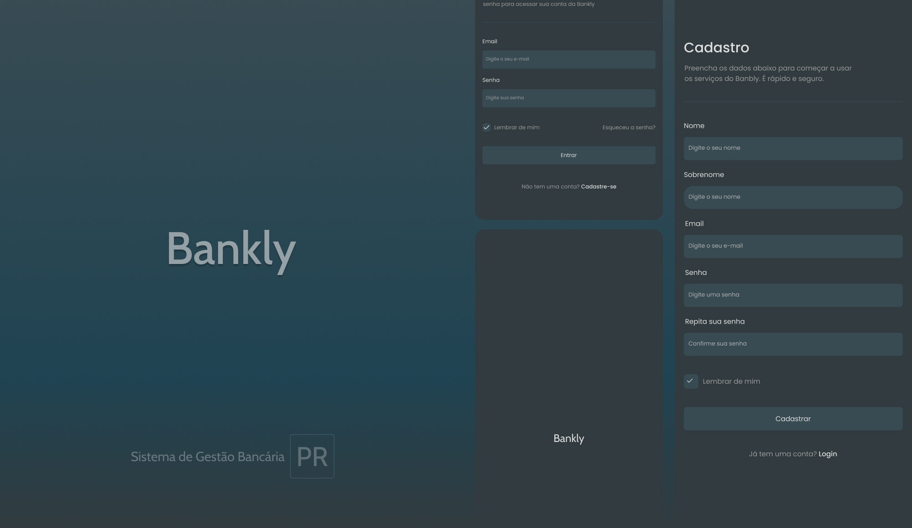

# Bankly - Sistema de Gestão Bancária

Bankly é uma aplicação bancária fictícia desenvolvida com o intuito de demonstrar uma interface de cadastro e login utilizando React, TypeScript, React Hook Form, Yup, React Router, e Toastify.

## Tecnologias Utilizadas

- **React**: Biblioteca JavaScript para construção da interface.
- **TypeScript**: Superset do JavaScript que adiciona tipagem estática.
- **React Hook Form**: Biblioteca para gerenciar formulários de forma simples e eficiente.
- **Yup**: Biblioteca para validação de formulários.
- **React Router**: Utilizado para navegação entre páginas.
- **React Toastify**: Para notificações de sucesso e erro.
- **CSS Modules**: Para o gerenciamento de estilos em módulos.

## Funcionalidades

1. **Tela Splash**: Exibe o logo do sistema na tela inicial.
2. **Cadastro de Usuário**: Formulário para criar uma nova conta, com validação de campos usando Yup.
3. **Login de Usuário**: Formulário para login, também com validação de campos.
4. **Redirecionamento Pós-Login**: Após o login bem-sucedido, o usuário é redirecionado para a área principal.
5. **Navegação**: Utiliza o React Router para navegar entre as páginas de login, cadastro e página inicial.

## Scripts

- **`dev`**: Inicia o servidor de desenvolvimento.
- **`build`**: Compila o projeto para produção.
- **`lint`**: Executa o linting no código.
- **`preview`**: Visualiza a versão de produção localmente.

## Instalação

1. Clone o repositório:

```js
git clone https://github.com/pauloricardoprogramador/Bankly.git
```

# Licença

Este projeto está disponível para uso pessoal e educacional.
